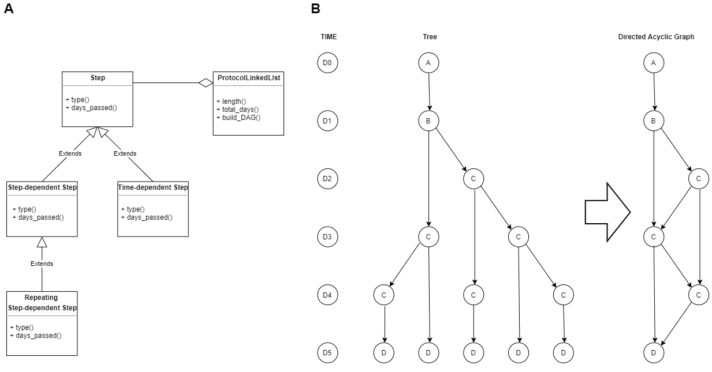
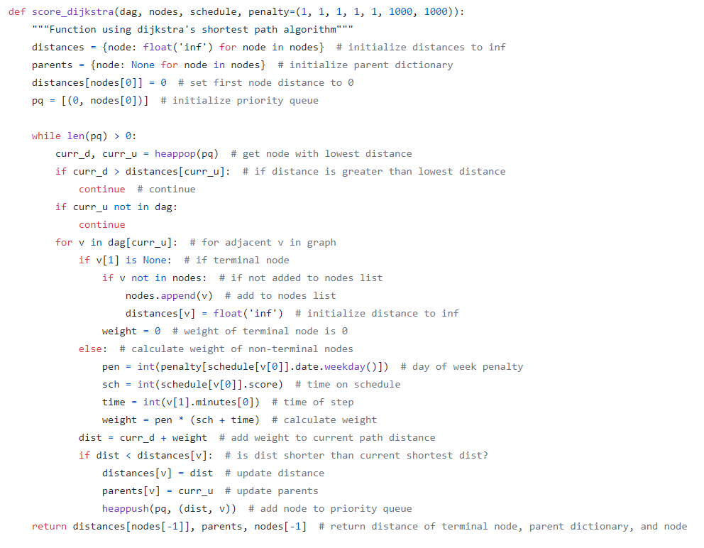
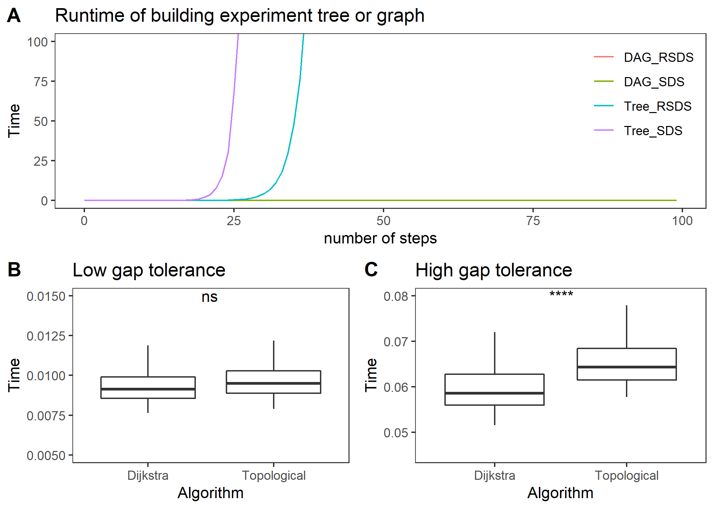

# Optimal Experiment Scheduler
 Jessica Mattick
### Table of Contents
[Abstract](#abstract)

[Project Narrative](#project-narrative)

[Design Considerations](#design-considerations)

[Design and Specifications](#design-and-specifications)

[Testing and Iterative Design](#testing-and-iterative-design)

[Restrictions, Limitations, and Constraints](#restrictions-limitations-and-constraints)

[Conclusion](#conclusion)

[References](#references)
### Abstract
A Django web application was created to handle scheduling of long protocols in an optimal way. Each possible experimental outcome of a protocol is represented as a directed acyclic graph. The application uses dynamic programming to score potential experiments against a schedule. The best score is chosen by applying Dijkstra’s Algorithm to determine the lowest scoring path. The source code for this application is published at: https://github.com/jmattick/experiment_planner

### Project Narrative
This project was inspired by the lengthy protocols required to differentiate induced pluripotent stem cells into other cell types. These protocols can be months long and often have steps that cannot be postponed. This means that researchers find themselves going into lab on the weekends to complete required steps. The goal of this application is to provide a way for researchers to better schedule their experiments so that they can avoid weekend work and reduce long days in lab.

### Design Considerations
Early design of the project focused on selecting the data structure to represent a protocol. Initially, a list containing tuples of step text and time was considered. However, it became clear that steps should be represented as custom objects that can be extended to fit the needs of different types of steps. Additionally, the list was changed to a doubly linked list containing step objects since the steps in the protocol would not logically be randomly accessed. A data structure was also needed to represent all possible experiment outcomes from a protocol. Since some steps can be repeating and have tolerance for gaps, the actual experiments may differ in the number of steps and dates that the steps are completed. The first data structure considered to represent all experiments was a tree that branches at each option in the protocol. The tree was later simplified to a directed-acyclic graph to avoid redundant branches.

The next major consideration was the method of determining the best experiments to schedule. Multiple methods were considered such as CPU scheduling algorithms and genetic algorithms, but a dynamic programming approach was chosen that scores each path in the directed-acyclic graph based on the cumulative scores of the previous nodes in the path. The paths that have the lowest scores are considered the optimal experiments to schedule. This scoring method can be used to select paths that are composed of less weekend work.  

Finally, the application was written in python using Django web framework using an SQLite database [3]. While other frameworks such as Node.js [4] may have better performance with regards to speed and I/O handling, python was chosen for its strength in data analysis. Python’s extensive data science and bioinformatics libraries allow the application to be open for expansion to include greater functionality beyond experiment scheduling. 

### Design and Specifications
The base Step class holds pointers to the previous and next steps in addition to other information about the step such as time, description, days from last step, and gap tolerance. All steps have a type and days_passed method. The type method returns the type of the step as a string and the days_passed method returns the maximum days the step can take to be used by the Protocol Linked List class. The Repeating Step-dependent Step class extends the Step-dependent Step class with it’s own implementation of the type method. The Time-dependent Step class has a days_passed method that returns the number of days since the start of the protocol. The Protocol Linked List class uses the days_passed step method to calculate the maximum total days of the protocol. This method is distinct from the length method in Protocol Linked List which returns the total number of steps. A UML diagram outlining the relationships of these classes is presented in Figure 1A. The most important method in the Protocol Linked List class is the build_DAG method, which returns a directed acyclic graph representing all possible paths the protocol can take. A demonstration of the simplification of the experiment tree to the experiment graph is shown in Figure 1B. 
 

**Figure 1 Overall Design (A)** UML diagram of Step classes in relation to the ProtocolLinkedList class. **(B)** Demonstration of tree based experiment representation and graph representation. Each letter represents a different step class. A = Step, B = Step-dependent Step, C = Repeating Step-dependent Step, and D = Time-dependent Step.

To determine the best experiment to schedule, the graph returned from the build_DAG method is scored based on alignment to the current schedule over a user set range of dates. The score is calculated dynamically by adding the score of the current node to the score of the previous node. The score at each step is calculated by adding the step time and the time on the schedule multiplied by a penalty based on the day of the week to prevent weekend steps. The final score of each path can be represented as ∑▒〖penalty (step time+schedule time)〗. The score of the experiment for a given start date is calculated using Dijkstra’s Algorithm (Figure 2) [2]. A priority queue is used to traverse the unvisited adjacent nodes in order of lowest score until the last node is reached and a final score can be returned. This is done for each date in the user defined start date range and scores are provided to the user so they can choose their preferred start date and add the optimal experiment to their calendar. 

 
**Figure 2 Dijkstra's Shortest Path Algorithm** Python implementation of Dijkstra’s shortest path algorithm. Weights are calculated from within the function for each adjacent node. 

### Testing and Iterative Design
Several tests were done to decide on implementation details of the final application and iterative changes were made based on the results of testing. Runtime testing was done on the build_DAG method and the original build_Tree method that represented the paths as a tree (Figure 3A). The runtime of building the tree or graph was measured using python’s timeit library over an increasing number of steps [6]. The runtime of the build_Tree method was exponential and impractical for the application so the superior build_DAG method was selected. This test also identified a max recursion issue in the original build_DAG method that was tail call optimized in the final implementation. 

Originally the application was using a topological shortest path algorithm to calculate the scores, but after feedback during DEV week other algorithms were tested. The execution time of the topological shortest path algorithm and Dijkstra’s algorithm was tested from within the application using timeit and output to a log. Both algorithms were tested on the same protocols using a start range of 365 days. The first test was done on a 500 day long protocol with a low gap tolerance of 1 day (Figure 3B). The second test was done on a 500 day long protocol with a high gap tolerance of 20 days (Figure 3C). There was not a significant benefit of using Dijkstra’s algorithm for the low gap tolerance protocol, but Dijkstra significantly outperformed the topological shortest path algorithm for the high gap tolerance protocol so Dijkstra was chosen for the final implementation. 

Feedback from demonstrations of the application facilitated UI improvements. The front-end framework Bootstrap was added to make the appearance more consistent and cleaner [1]. The dashboard of the scheduling page was improved using Plotly to visualize the output scores of each start date as a bar graph [5]. 

**Figure 3 Runtime Tests (A)** Runtime analysis of building a tree or directed acyclic graph experiment form a protocol linked list with n = 3. **(B)** Execution time of finding the shortest path in the graph using Dijkstra’s Algorithm or a Topological Shortest Path Algorithm for a 500 day protocol with a low gap tolerance (gap = 1) or **(C)** high gap tolerance (gap = 20) with n = 365. Significance was determined using a paired t-test (**** p <= 0.0001). All timing was done with python’s timeit library. Plots and statistics generated in R using ggplot2 [7]. 

### Restrictions, Limitations, and Constraints
Some limitations to the current version of this application is that adding protocols manually can be a lot of effort for the user for very long protocols with many different types of steps. Another limitation is that the calendar only considers the current user’s schedule and does not consider the schedule of other members of the lab who might be using the required equipment on the same days. Ideally this will be extended to allow users from the same group share protocols and calendars. 

### Conclusion
Overall, this application successfully provides a way for users to schedule long protocols in an optimal way. Protocols can be scheduled in a way that avoids weekend work and very long days. The runtime and execution time testing guided decisions that improved the final implementation of the application. While the initial goals of this application have been met, the application can be extended to add additional functionality to facilitate the work of researchers.

### References
[1] Bootstrap (Version 4.3.1) [Software] (2019) Available at https://getbootstrap.com

[2] Dijkstra, E.W. A note on two problems in connexion with graphs. Numer. Math. 1, 269–271 (1959). https://doi.org/10.1007/BF01386390

[3] Django (Version 3.0.2) [Software]. (2019). Available at https://djangoproject.com 

[4] Node.js (Version 14.0.0) [Software] (2020) Available at https://nodejs.org

[5] Plotly.py (Version 4.5.4) [Software] (2020) Available at https://plotly.com 

[6] Python (Version 3.74) [Software]. (2019). Available at https://www.python.org

[7] Wickham, H. ggplot2: Elegant Graphics for Data Analysis. Springer-Verlag New York. (2009) https://doi.org/10.1007/978-0-387-98141-3

